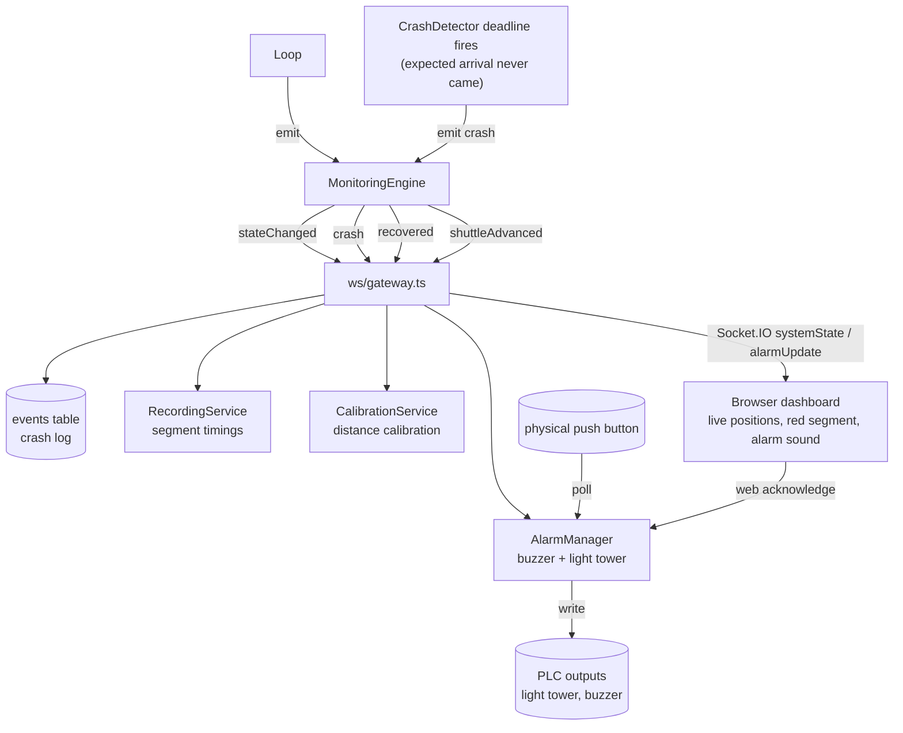

# System Control Flow — Reading Sensor / PLC IO

How the monitoring system reads plant IO and turns it into model updates and
alerts. The core is a fixed **200 ms poll cycle**: read every input tag in one
batch, detect signal edges, react, emit events. (See also
[`code_explaination.md`](./code_explaination.md) and [`method.md`](./method.md).)

---

## 1. The 200 ms poll / read cycle

```mermaid
flowchart TD
    timer([" setInterval — every 200 ms<br/>config.pollIntervalMs "]) --> tick

    subgraph engine [" MonitoringEngine.tick() "]
        tick[" connected? "] -->|no| skip[" skip this cycle "]
        tick -->|yes| collect[" collect all input node IDs<br/>from every loop &rarr; checkpoint "]
        collect --> read[" driver.readMany(nodeIds)<br/>ONE batched read "]
    end

    read --> driver{ " PlcDriver<br/>(selected at boot) " }
    driver -->|mode = real| opc[" OpcUaDriver<br/>node-opcua &rarr; real PLC "]
    driver -->|mode = simulation| sim[" SimulatedDriver<br/>in-memory tag store "]
    opc --> plc[(" PLC / OPC UA server<br/>detect, ID, GO, sign-off ")]
    sim --> simstore[(" sim tag map<br/>written by UI sim panel ")]

    plc --> snap[" snapshot:<br/>nodeId &rarr; value "]
    simstore --> snap
    snap --> loops[" for each Loop:<br/>Loop.tick(snapshot) "]

    loops --> cp[" Checkpoint.updateFromSnapshot()<br/>rising-edge detection "]
```

`tagRegistry` resolves each checkpoint's logical tags (`detTagId`, `idTagId`,
`goTagId`, `signoffTagId`) to OPC **node IDs**, so only the signals actually used
by configured checkpoints are polled, de-duplicated across loops.

---

## 2. Signal → event → reaction (inside one tick)

```mermaid
flowchart LR
    snap[" tag snapshot "] --> cp

    subgraph cp [" Checkpoint.updateFromSnapshot() "]
        direction TB
        levels[" read det / id / go / signoff<br/>compare to previous sample "]
        levels --> e1{{ " arrivalEdge<br/>(low&rarr;high) " }}
        levels --> e2{{ " idChangedEdge<br/>(new shuttle ID) " }}
        levels --> e3{{ " goEdge<br/>(release pulse) " }}
    end

    e2 --> hid[" handleIdChange()<br/>spawn / advance by ID "]
    e1 --> harr[" handleArrival()<br/>confirm arrival, snap shuttle "]
    e3 --> hgo[" handleGo()<br/>depart shuttle "]

    hid --> vs[" VirtualShuttle<br/>stopped / moving / crashed "]
    harr --> vs
    hgo --> vs

    hgo --> sched[" CrashDetector.startTracking()<br/>schedule deadline = ETA + buffer "]
    harr --> conf[" CrashDetector.confirmArrival()<br/>cancel deadline "]
```

A level that stays high for several samples produces **exactly one** edge event,
because `Checkpoint` remembers the previous sample and fires only on transition.

---

## 3. Events out — alarms, log, dashboard



**Key idea:** the system reads inputs by *polling* and converts them to *events*
by *edge detection*; a crash is the one event it cannot read directly — it is
inferred from an **expected arrival event that never arrives** before its
scheduled deadline.

---

## Legend — where each step lives

| Step | File |
|---|---|
| Poll loop / batched read | `server/src/monitoring/MonitoringEngine.ts` |
| Real vs simulated IO | `server/src/opc/OpcUaDriver.ts`, `SimulatedDriver.ts`, `PlcDriver.ts` |
| Tag → node-ID resolution | `server/src/opc/tagRegistry.ts` |
| Edge detection | `server/src/monitoring/Checkpoint.ts` |
| Per-loop reactions | `server/src/monitoring/Loop.ts`, `VirtualShuttle.ts` |
| Crash deadlines | `server/src/monitoring/crashDetection.ts` |
| Event fan-out | `server/src/ws/gateway.ts` |
| Alarm outputs | `server/src/alarm/AlarmManager.ts` |
